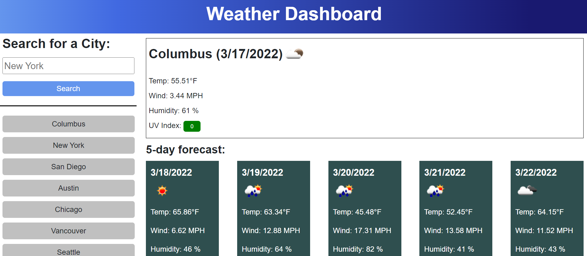

# Weather Dashboard

## Description

This application is a dashboard that displays the current weather conditions as well as the 5-day forecast from a city that has been submitted in the search form. First, the city name is sent as a parameter to the OpenWeather Geocoding API in order to get the coordinates of that city. These coordinates are then used to fetch weather data from the OpenWeather One Call API.

The current weather conditions (including temperature, humidity, wind speed, and UV index) in that location are displayed at the top. Underneath the current weather conditions, the 5-day forecast for that location is displayed. The current weather and each day of the forecasted conditions also display a weather icon corresponding to those conditions. The UV index displays a color corresponding to the severity of the conditions. Green is displayed when the UV index is favorable, yellow is displayed when the UV index is moderate, and red is displayed when the UV index is severe.

Under the search form on the left side of the page, the list of cities the user has previously search for is displayed. The cities that have been searched for previously are stored in local storage and loaded into a search history list. If one of the cities from the search history list is clicked, then the weather data from that city is displayed on the page. When a new city is search for, that city is added to the search history list.

## Screenshots

## Website

[https://emilyk221.github.io/weather-dashboard/](https://emilyk221.github.io/weather-dashboard/)

## Resources

I used the following resources:
- [Luxon documentation](https://moment.github.io/luxon/#/)
- [OpenWeather Geocoding API Documentation](https://openweathermap.org/api/geocoding-api)
- [OpenWeather One Call API Documentation](https://openweathermap.org/api/one-call-api)
- [Stack Overflow Question about displaying a weather icon](https://stackoverflow.com/questions/44177417/how-to-display-openweathermap-weather-icon)